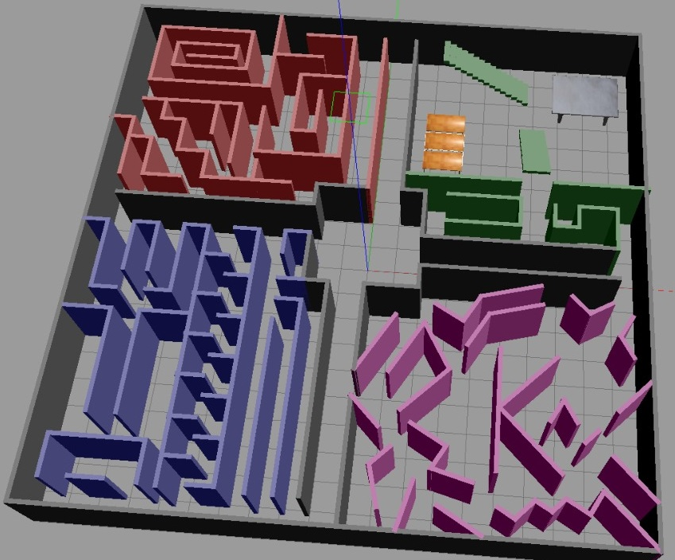

# XploreR

In partnership with [Karelics Oy](https://karelics.fi), we integrated an autonomous exploration algorithm into their existing robotic solution using ROS2 and Docker. Additionally, we connected the robot to the Unity game engine and demonstrated the visualization of robot data (pose, generated map, autonomous exploration goals) in a VR scene that we created.

__[Artemis Georgopoulo](https://github.com/artemisge)  |  [Fabiano Manschein](https://github.com/fabulani)  |  [Shani Israelov](https://github.com/shani1610)  |  [Yasmina Feriel Djelil](https://github.com/YasminaDjelil)__ (equal contribution)

__[Code](https://github.com/Fabulani/xplorer)  |  [Blog](https://karelics.fi/xplorer-autonomous-exploration-with-virtual-reality-visualization/)  |  [Video](https://youtu.be/dvud4rTNY1E)   |  [Presentation](https://github.com/Fabulani/xplorer/blob/main/docs/XploreR_presentation.pdf)  |  [Report](https://github.com/Fabulani/xplorer/blob/main/docs/XploreR_report.pdf) __


*A screenshot of the map generated by the SAMPO2 robot autonomously exploring an unknown environment. Green spheres are possible goal poses, blue and red lines are detected frontiers.*

__Overview Video__

[](https://youtu.be/dvud4rTNY1E)

> *The XploreR project is the outcome of eight weeks of collaboration with [Karelics Oy](https://karelics.fi/) for the Robotics and XR class at the University of Eastern Finland, taught by Professor Ilkka Jormanainen.*

# Table of contents

- [XploreR](#xplorer)
- [Table of contents](#table-of-contents)
- [Requirements](#requirements)
- [First-time setup](#first-time-setup)
  - [Windows](#windows)
  - [Linux](#linux)
- [Docker with GUIs](#docker-with-guis)
- [Running the project](#running-the-project)
  - [Detached mode](#detached-mode)
  - [Opening a new terminal inside a container](#opening-a-new-terminal-inside-a-container)
  - [Resume exploration](#resume-exploration)
  - [Changing the Gazebo world](#changing-the-gazebo-world)
  - [Creating new worlds](#creating-new-worlds)
- [Unity](#unity)
- [Branches](#branches)
- [Todo list](#todo-list)
- [Thanks](#thanks)

# Requirements

The project uses the following technology stack:
- ROS 2 Galactic (Gazebo, turtle bot simulation, Rviz)
- Docker
- Unity 2021.3.14f1

As such, to fully run the project, the following is required:
- Docker (and docker-compose): recommended to install Docker Desktop
- (Windows) VcXsrv Windows X Server: https://sourceforge.net/projects/vcxsrv/ required for turtlebot3 gazebo simulation
- Unity 2020+: for the Unity scene


# First-time setup

For `turtlebot3_gazebo` and similar GUI ROS packages to work with Docker, the following steps are necessary. Follow whichever fits your OS.

## Windows

1. Download and install VcXsrv Windows X Server: 
https://sourceforge.net/projects/vcxsrv/

2. Start XLaunch (VcXsrv Windows X Server). **Note:** this can probably be replaced with other X server program.
    - Press next until you get to `Extra settings` tab.
    - Deselect `Native opengl`.
    - Select `Disable access control`.
    - **Note:** sometimes when running simulations XLaunch might get buggy, so you have to kill the whole process and start it again.

3. Get your local IP from `ipconfig`.
   - **Note:** this can be done by pressing the Windows key, typing `cmd`, selecting the `Command Prompt` app, then typing `ipconfig`. Search for a line like this:
    `IPv4 Address. . . . . . . . . . . : 10.143.144.69`

4. Open the `environment.env` file and paste your IP in the `DISPLAY` variable before `:0`, like so: `DISPLAY=10.143.144.69:0`. Your `environment.env` file should look like this:

```txt
DISPLAY=10.143.144.69:0

ROS_DISTRO=galactic
ROS_DOMAIN_ID=1
TURTLEBOT3_MODEL=burger
GAZEBO_MODEL_PATH=/opt/ros/galactic/share/turtlebot3_gazebo/models/
GAZEBO_WORLD_PATH=/opt/ros/galactic/share/turtlebot3_gazebo/worlds/

COMPOSE_DOCKER_CLI_BUILD=0
```

**IMPORTANT:** you'll need to update your IP every time it changes!

## Linux

To run Docker without `sudo`:

```bash
sudo groupadd docker
sudo gpasswd -a $USER docker
newgrp docker
```

Run the following command:

```bash
xhost +local:`docker inspect --format='{{ .Config.Hostname }}' gazebo`
```

**IMPORTANT:** This command is required on every reboot.

In the `environment.env` file, check if `DISPLAY` is correct by opening a terminal and running:

```bash
echo $DISPLAY
```

Write the result to `DISPLAY` (normally, it's either `:0` or `:1`). Now you're ready to run the project!

**Note:** If the project still doesn't work, you might need to install [Nvidia Container Toolkit](https://docs.nvidia.com/datacenter/cloud-native/container-toolkit/install-guide.html#setting-up-nvidia-container-toolkit), then run the following:

```bash
sudo apt-get update
sudo apt-get install -y nvidia-docker2
sudo systemctl restart docker
```

# Docker with GUIs

If you've done the first-time setup, remember to do the following on every system reboot:

- If on **Windows**, open XLaunch (X server) and configure it like previously. Update your IP in the `environment.env` file.
- If on **Linux**, remember to run 
    ```bash
    xhost +local:`docker inspect --format='{{ .Config.Hostname }}' gazebo`
    ```
    on every reboot.

# Running the project

Spin-up the containers with:

```bash
docker-compose up
```

If this is your first time here, it might take a couple minutes to build the image. Once it's done, you should see `explore`, `gazebo`, and `rostcp` containers up and their messages.

To shutdown, use `CTRL+C` in the terminal running the containers.

**NOTE:** often, the robot gets stuck at the start of the simulation. To fix this, go to Rviz and give it a `Nav2 Pose Goal` (make the robot move and map a bit). If the `explore` node considered the exploration done at the start of the simulation, follow the instruction in [Resume exploration](#resume-exploration).

## Detached mode

Alternatively, you can run the containers in detached mode:

```bash
docker-compose up -d
```

This will leave the terminal free while the containers run in the background. To shutdown, run the following:

```bash
docker-compose down
```

## Opening a new terminal inside a container

You can `docker exec` into any of the containers and run `ros2` commands from the get-go (sourcing is done automatically). For example, going into the `explore` container:

```bash
docker exec -it explore bash
```

## Resume exploration

Sometimes the `explore` node will stop exploration, reporting that there are no more frontiers. This can happen when the simulation takes too long to launch. To resume exploration, `exec` into a container and run the following command:

```bash
ros2 topic pub /explore/resume std_msgs/Bool '{data: true}' -1
```

This publishes a single message to the `/explore/resume` topic, toggling the exploration back on. If the exploration keeps stopping, remove the `-1` so it is constantly resumed.

## Changing the Gazebo world

The map is set by default to `labyrinthe.world`, a complex labyrinthe world created for this project. It is separated in 4 zones, with a central start area:
- red: longer hallways and a spiral
- blue: simple long hallways, a path with many tight corners, and a trident shaped path
- green: furniture room with 2 stairs, a series of 3 small tables, and a big table
- purple: highly chaotic and randomly placed walls

All zones are connected to their neighbor zones and the central area.



To change the world loaded in Gazebo, open `docker-compose.yml` and look for the `gazebo` service. There, under the `command`, change the last part of the path in the `world:=` parameter with one of the following (or any worlds added to the `worlds` folder):

- labyrinthe.world
- empty_world.world
- turtlebot3_world.world
- turtlebot3_house.world
- turtlebot3_dqn_stage1.world
- turtlebot3_dqn_stage2.world
- turtlebot3_dqn_stage3.world
- turtlebot3_dqn_stage4.world

For example, to change it to the `turtlebot3_house.world` world, the final command would look like this:

```docker
command: ros2 launch nav2_bringup tb3_simulation_launch.py slam:=True world:=/opt/ros/galactic/share/turtlebot3_gazebo/worlds/turtlebot3_world.world
```

**NOTE:** except for the labyrinthe, this will load the world without spawning the robot. To add a robot, go to the `Insert` tab and add a `turtlebot` to the world.

**NOTE2:** the labyrinth is intentionally called labyrinthe, as it was made in France.

## Creating new worlds

The `gazebo` container can be used to create new worlds and models. Follow the following steps:
1. Set one of the `.world` worlds as described in [Changing the Gazebo map](#changing-the-gazebo-map) to use it as a base/template and spin-up the `gazebo` container
2. In the Gazebo simulation, click on the `Edit` tab in the toolbar, then `Building editor`
3. Create your model (warning: you can't save and edit it later!)
4. Save the model somewhere easy to find in the container file system (e.g., the `root` folder)
5. (requires the `Docker` extension on VS Code) Go to VSCode, access the Docker tab, and search for the model file you saved. Download it to the `models` folder
6. Exit the `Building editor`
7. Go to the `Insert` tab and click on `Add Path`. Search for the folder containing your model's folder and add it
8. Now you can add your model to the world. Add any other models as desired.
9. Once done, go to `File` and `Save world as`. Save it in an easy-to-find folder (e.g., root) as a `.world` file
10. Repeat step `5.`, but for the `.world` file, and save it in the `worlds` folder.

With this, your world is available for use by following the [Changing the Gazebo map](#changing-the-gazebo-map) subsection. All models saved to the `models` folder will also be available in the container next to the `turtlebot` models.

**NOTE:** new files in the `models` and `worlds` folders will require the container to be rebuilt with:

```bash
docker-compose up --build
```

#  Unity

This project is designed to communicate with a Unity scene running the `ROS-TCP Connector` and `Unity Robotics Visualizations` packages. This is achieved via the `rostcp` container running the `ROS-TCP-Endpoint` package from the `main-ros2` branch. All of this is based on the tutorials provided by Unity on Github:

- [Unity-Technologies/Unity-Robotics-Hub/tree/main/tutorials/ros_unity_integration](https://github.com/Unity-Technologies/Unity-Robotics-Hub/tree/main/tutorials/ros_unity_integration)
- [Unity-Technologies/Robotics-Nav2-SLAM-Example](https://github.com/Unity-Technologies/Robotics-Nav2-SLAM-Example)

To replicate this, follow the `ros_unity_integration` tutorial first.

Furthermore, we used a VR scene to visualize data from the robot. The following headsets were tested:
- Samsung Odyssey with HMD Odyssey controllers (WMR)
- Pimax 8KX with both Index, Sword, and Vive controllers (SteamVR)

Made with Unity editor version `2021.3.14f1`.

Assets used:
- [Skybox Series Free](https://assetstore.unity.com/packages/2d/textures-materials/sky/skybox-series-free-103633)
- [Northern Lights Pack](https://assetstore.unity.com/packages/vfx/particles/environment/northern-lights-pack-86980)

# Branches

The following branches are available:
- The `main` branch contains the most up-to-date working version of the project. Here, the Unity scene doesn't contain VR content.
- The `vr` branch contains the Unity VR scene.
- The `unity-pc-backup` branch is a backup for the Unity scene without VR.

The Unity scene without VR has only the ROS2 integration packages: communication and visualization. It's purpose is to be used with mouse and keyboard.

# Todo list

Current tasks and planned features include:
- [ ] Change the VR scene to a 3D map view, allowing the user to see the map in more detail.
- [ ] Add user interaction to both the 2D and 3D maps, where user interaction (tap, touch) could be used to switch from autonomous exploration to manual control, allowing the user to set the navigation target point.
- [ ] Add new autonomous exploration strategy implementations, e.g. Next-Best-View exploration, and compare the different strategies.
- [X] Add new Gazebo worlds for testing autonomous exploration (e.g., a labyrinth).
- [ ] Remake the VR scene with up-to-date XR plugins, and allow interchangeable use between keyboard+mouse and VR headset.
- [ ] Add a Augmented Reality (AR) scene for visualizing ROS2 data in a phone app with AR (e.g., using a QR code).
- [ ] Add the Unity project `./xplorer_unity` to Git LFS.
- [x] Fix the video previews so they look like video players instead of a static image.

# Thanks

We would like to sincerely express our appreciation to [Karelics Oy](https://karelics.fi) for the support they’ve sent our way working on this project.

This project makes use of the following open source libraries:
* [m-explore-ros2](https://github.com/robo-friends/m-explore-ros2) for autonomous exploration on ROS2

Many thanks to the authors!
